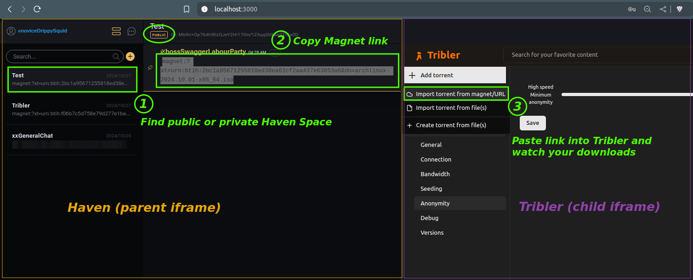
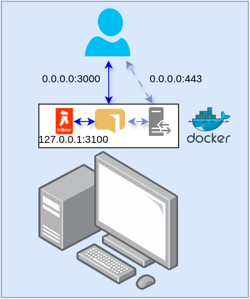
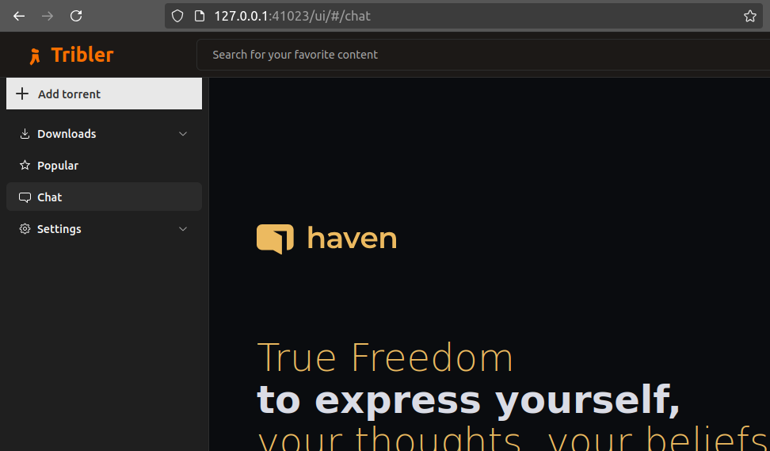
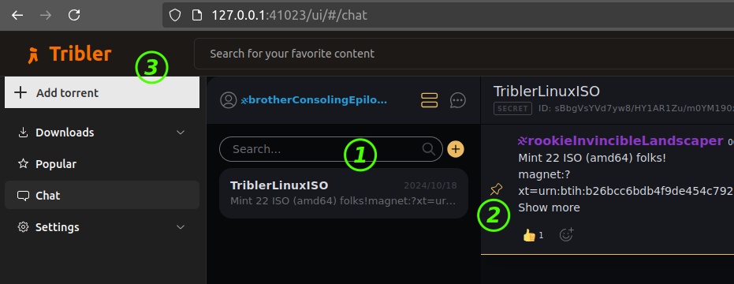
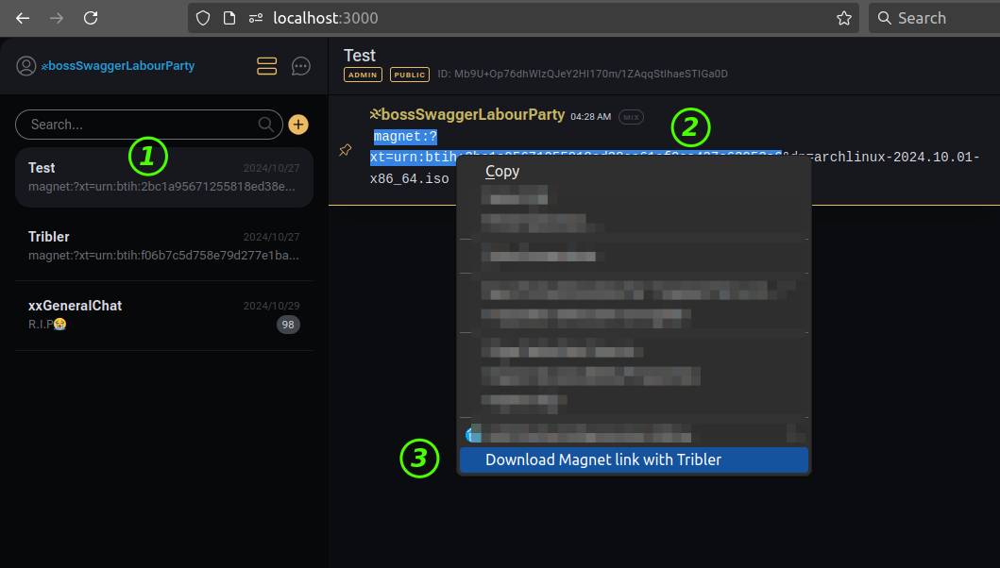
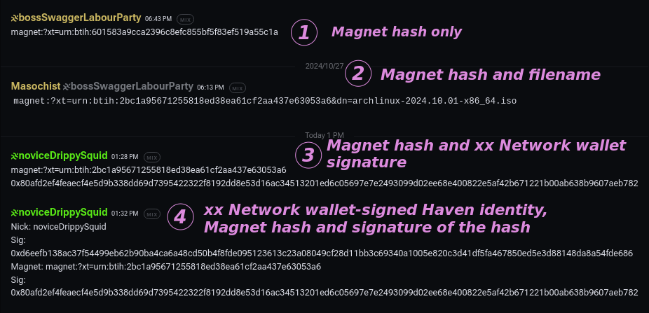
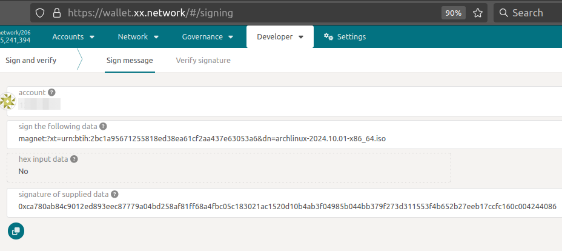
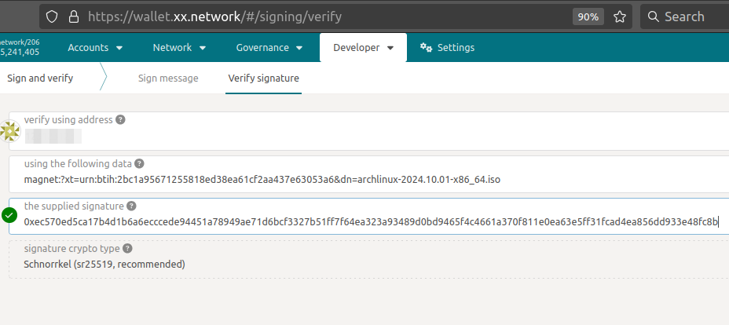
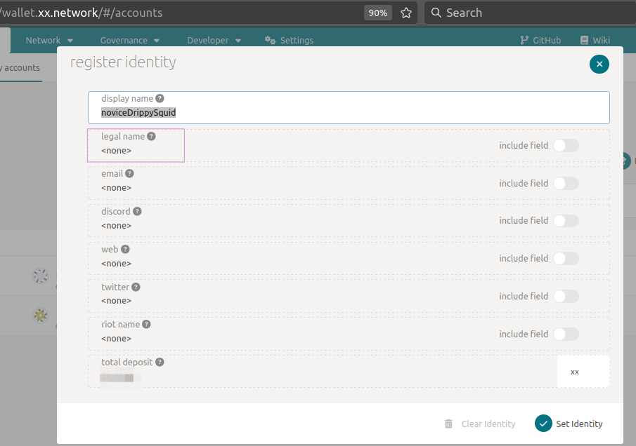

- [xx Network Haven - Tribler Proof-of-Concept](#xx-network-haven---tribler-proof-of-concept)
  - [Haven with Tribler iFrame (v2)](#haven-with-tribler-iframe-v2)
    - [Run in Docker](#run-in-docker)
    - [Run outside of Docker](#run-outside-of-docker)
  - [Tribler with Haven iFrame (v1)](#tribler-with-haven-iframe-v1)
  - [Other information](#other-information)
    - [Tor- and VPN-free experience](#tor--and-vpn-free-experience)
    - [Simplify copy-paste operations](#simplify-copy-paste-operations)
    - [Example workflow](#example-workflow)
  - [Known issues](#known-issues)
    - [Haven loads slowly the first time or after browse cache is cleared (v2, v1)](#haven-loads-slowly-the-first-time-or-after-browse-cache-is-cleared-v2-v1)
    - [Inconvenient navigation (v1)](#inconvenient-navigation-v1)
    - [Haven identity and space (channel) configuration (v1)](#haven-identity-and-space-channel-configuration-v1)
    - [Notifications (v1)](#notifications-v1)
    - [Security (v2)](#security-v2)
    - [iFrame (v2, v1)](#iframe-v2-v1)
  - [Additional information](#additional-information)
  - [License](#license)


## xx Network Haven - Tribler Proof-of-Concept

This repository contains several "proof-of-concept" ideas for [xx Network]((https://xx.network)) [Haven](https://haven.xx.network) and [Tribler](https://github.com/Tribler/tribler) integrations.

- [v2](https://github.com/armchairancap/xx-tribler-haven/releases) - Haven chat with a Tribler iFrame (recommended)
- [v1](https://github.com/armchairancap/xx-tribler-haven/releases/tag/v1.0) - Tribler with a Haven chat iFrame (source code in [Release v1.0](https://github.com/armchairancap/xx-tribler-haven/releases/tag/v1.0))

v2 is probably more interesting to general users. [This post](https://armchairancap.github.io/blog/2024/10/29/xx-haven-with-tribler#what-integrations-and-why) talks about some advantages and disadvantages of each approach as I see them.

A seamless way to natively integrate Haven in Tribler could be achieved by using xxDK from Tribler so that Haven runs within Tribler, but that's beyond my abilities and would require more extensive patching that would also be harder to maintain and review.

### Haven with Tribler iFrame (v2)

(Right-click and open screenshot in new tab for a clearer view.)



- (1) Join a private or public channel of your choosing or create one
- (2) Copy Magnet link(s) (or paste them, to share your own)
- (3) Paste them to `+ Add torrent` > `Import torrent from magnet` in Tribler iFrame

What does this entail? Just two patches from this repo:

- Add Tribler iFrame to Haven (`build/haven/haven-DefaultLayout.tsx.patch`)
- Allow unauthenticated access to `localhost` and `haven` in Tribler's REST manager (`build/tribler/tribler.patch`)
- Build & run Haven and Tribler on the same host on LAN

#### Run in Docker

You may build the two containers by yourself like this:

```sh
cd build/haven
docker build -t haven-for-tribler:latest .
cd ../tribler
docker build -t tribler-haven:latest .
cd ../../
```

Or you can do `cd build && ./build.sh` (which does the same thing).

This creates two container images which I reference in the sample compose.yaml:

```sh
$ docker images
REPOSITORY           TAG         IMAGE ID       CREATED          SIZE
tribler-haven        latest      8693940f6d6f   9 minutes ago    1.39GB
haven-for-tribler    latest      d637b742a675   14 minutes ago   2.67GB
```

Run with `cd build/tribler && docker compose up` and access Haven at http://localhost:3000. 

Create a strong password when creating Haven identity and remember to [back it up](https://armchairancap.github.io/docs/haven-user-guide/identity#backup-an-identity).

There's a sample Docker compose file in the build/tribler directory. 

By default - and the patch for Haven has that hardcoded - Tribler API port is 3100 and the password is 'changeme' (as per upstream). In this PoC that's hard-coded into the Haven patch, so if you want to change these you may edit the patches and Docker compose to match whatever password you set and port you want to use. 

If you decide to change the Tribler API key, for example, you can do it in Tribler UI, then quit Tribler, change the key in compose.yaml, rebuild Tribler container and start Tribler. That should be enough.

Tribler can be accessed directly from localhost for convenience, but in this approach default approach is to access it from Haven's iFrame. Haven itself could bind localhost (if you're running on your box) or external IP (if you're running the stack on a small ARM64 computer, for example).



HTTPS isn't required here, but you could access everything through a reverse HTTPS proxy (Caddy, NGINX, etc.). For these more advanced Docker compose scenarios (TLS, reverse proxy, etc.) you can consider Docker compose recipes I have published (see the Resources section).

#### Run outside of Docker

- Haven:
  - Clone Haven source code and replace the `src/layouts/DefaultLayout/DefaultLayout.tsx` with `build/haven/patched-DefaultLayout.tsx`. Note that iFrame URL must point to hostname/IP and port where Tribler will be running.
  - Edit `.env` in the root of Haven source code to redirect Haven invites to localhost:3000 or whatever your Haven will be running at.
  - `npm run dev`
- Tribler:
  - Patch `src/tribler/core/restapi/rest_manager.py` with `build/tribler/tribler.patch`
  - Build and run

Key security and connectivity assumption is Haven and Tribler run on the same host. See the Dockerfiles for details.

If you want a crash course in operating this thing, see [this demo](haven-tribler-demo.mp4); play it back at 0.5x speed if captions disappear too quickly. In References below you can find links to my Haven User Guide.

### Tribler with Haven iFrame (v1)

I don't recommend this approach except to privacy fanatics or users who download one file at a time.

(Right-click and open in new tab for a clearer view.)



Chat:



- (1) Click on `+` in Haven to add Space (channel). You need an invite link (and password, for private Spaces)
- (2) Copy `magnet` link (preferred) or `.torrent` URL 
- (3) Paste the link to `+ Add torrent` modal to start download 

If you want to retain Haven session, you could open another tab with Tribler UI (navigating away will mean you'll have to login again). If you've got the link you want and don't need to go back to Haven, you can use the same tab.

What does this approach involve?

- Patch Tribler menus to add link to Chat page
- Add a page with xx Network iFrame (localhost or haven.xx.network or other)

**v1** is a bit painful to run. Download release v1.0, work on building Tribler from the source, then run it. Haven doesn't have to be patched so it can be simply used from https://haven.xx.network or locally (remember to modify the iFrame URL in Tribler to point it to http://localhost:3000 or such).

### Other information

#### Tor- and VPN-free experience

Haven provides privacy to Tribler users (and vice versa):

- You don't have to use Tor to privately obtain Magnet links. As Tribler doesn't use Tor either, it's a Tor-free experience
- All chats are private and confidential (Post-Quantum End-to-End Encryption mixed with xx Network's cMixx mixnet)
- Your Haven identity is private and no registration is required
- There's no telemetry, adds or anything like that
- Gratis & open source

#### Simplify copy-paste operations

To ease copy-paste or indeed, make it possible to not use a patched version of Haven or Tribler, I created this toy [add-on for Firefox](https://github.com/armchairancap/magnet-link-downloader-tribler-firefox).



The add-on can be used with any Haven and Tribler instances, but in v1.0 **of add-on** all options are hard-coded in the add-on itself (see the add-on repo). If you change Tribler port or API key (explained above), then you'll have to change the same options in  this extension.

#### Example workflow

One can first *seed* a *signed* text file with a list of public Haven Spaces (channels) or share their Space invite with others via Haven. Signing can be done from a xx Network wallet address or other identity ([xx Network identity](https://wallet.xx.network/#/council), PGP, ENS, etc.) - see further below about on-chain identity options.

Downloaders can download trusted (i.e. signed by trusted individuals) Space ("channel") invites for public Spaces from Tribler, without searching for them on the Web. 

Magnet links can be signed by you in your xx Network wallet, whether they're a list of your Tribler-related channels or list of downloads. An example of an [Archlinux](https://archlinux.org/download/) download link.

- Data: `magnet:?xt=urn:btih:2bc1a95671255818ed38ea61cf2aa437e63053a6&dn=archlinux-2024.10.01-x86_64.iso`
- Example (xx Network wallet/address) signature: `0xec570ed5ca17b4d1b6a6ecccede94451a78949ae71d6bcf3327b51ff7f64ea323a93489d0bd9465f4c4661a370f811e0ea63e5ff31fcad4ea856dd933e48fc8b`

Among real-life friends we could share just torrent hashes (file name is optional, as well as the rest of the stuff if seeding is done on well known public trackers).

In other cases you may want to sign your post from a wallet address (example 3), assuming others know your wallet address. 



An even more elaborate example is example 4, where the poster signed both their Haven identity and Magnet link. What's the difference? In (3) we know the Magnet link was signed by a certain xx Network wallet address, but not if noviceDrippySquid is copy-pasting that crap, or sharing himself. 

In (4) we have the proof that the xx Wallet address owner is behind the noviceDrippySquid identity in Haven. 

Notice that in Haven screenshot there's no info on the (signing) wallet address, which makes it impossible to verify. 

Maybe the poster doesn't want to share it publicly, for example. xx coin is not a "privacy coin", so sometimes not sharing one's address in a public (or other) Space is a good idea.

How to [sign](https://wallet.xx.network/#/signing) a Magnet link (or other string) using your xx Network wallet address:



Validate ("[verify](https://wallet.xx.network/#/signing/verify)") a link using xx Network wallet: you need the signing wallet (address, public key) and a signature to validate (from the previous signing step above)



Note that finding one's address can be made easier: you can use xx Wallet to set an on-chain identity on an address that you use in Haven. 

For an example, noviceDrippySquid could set an address'es `legal name` to noviceDrippySquid to make it easy to find that wallet address.



### Known issues

#### Haven loads slowly the first time or after browse cache is cleared (v2, v1)

This is how Haven works... It takes a while and the solution is to run it locally from a container (see below) which speeds it up significantly. 

Subsequent restarts with existing (encrypted) cache are much faster.

#### Inconvenient navigation (v1)

If you navigate away from Chat menu, going back means you have to log in to Haven again. 

Workaround: open Tribler UI in two tabs, one for chat and one for the rest of it. 

#### Haven identity and space (channel) configuration (v1)

Remember to save account information (identity) and export channel admin keys (if you're channel admin; if not, just copy the invite link). 

This is no different from regular Haven, but Tribler users may forget to do it. Once you restart Tribler and use Chat, you will need to login (Haven cache is encrypted) or load both channel and user profile if browser cache gets cleared.

#### Notifications (v1)

It appears those don't work because of default iFrame security settings. 

This could be worked around, but I haven't tried it.

#### Security (v2)

In v2 Tribler allows unauthenticated access to port 3100 from 127.0.0.1 and `haven`, which is a small compromise that I found reasonable for this PoC.

If you want to share Haven to other users, though, remember they will have access to the same Tribler instance, so do not share the same Haven to friends or family if that's not what you intend. You can easily create additional containerized Haven instances for them - just use my generic containerized Haven recipe (see Resources) to provide access to shared unpatched Haven server over TLS to port 443, and you'll be fine.

Also keep in mind that Tribler doesn't authenticate localhost users, so other users on the same computer could access Tribler's Web UI directly the same as you, by using the default API key ('changeme'). How to change that is described in How to Run (above).

Also remember to check your privacy assumptions for Tribler by reading their documentation. Note that files seeded in Tribler can be found and downloaded by others. You may encrypt them before seeing, if that's what you need, but this PoC does not consider such use cases.

#### iFrame (v2, v1)

We shouldn't use iFrame in the first place. But it's easy to do and v2 is also easy to use with some very small security compromises.

Other ways:

- Integrate two applications in one to eliminate iFrames
- Use xx Network xxDK from Tribler to provide "native" chat built into Tribler
- Build a sophisticated browser add-on/extension that can talk to headless Tribler and use it from Haven (the toy extension that's available could be expanded)

### Additional information 

- [Learn about xx Network](https://learn.xx.network) - how it works, white paper pointers, etc.

- My [Haven User Guide](https://armchairancap.github.io/docs/category/xx-network-haven-users-guide). An **Admin** Guide can be found on the same site.

- My notes for [containerized Haven (formerly Speakeasy) can be found here](https://github.com/armchairancap/xx-haven-container).

- [Developer section of the xx Network Web site](https://xx.network/developers-blockchain/)

- You can talk to xx Network community and developers in [General Chat on Haven](https://haven.xx.network/join?0Name=xxGeneralChat&1Description=Talking+about+the+xx+network&2Level=Public&3Created=1674152234202224215&e=%2FqE8BEgQQkXC6n0yxeXGQjvyklaRH6Z%2BWu8qvbFxiuw%3D&k=RMfN%2B9pD%2FJCzPTIzPk%2Bpf0ThKPvI425hye4JqUxi3iA%3D&l=368&m=0&p=1&s=rb%2BrK0HsOYcPpTF6KkpuDWxh7scZbj74kVMHuwhgUR0%3D&v=1) (recommended: Brave Browser with Brave Shields disabled for the site) or - less adventurously - ask in the #developers channel in the xx Network Discord.

### License

Tribler uses the GPL 3.0 license, so Tribler patch files such as `tribler.*.patch` that modify files from the Tribler repo are released under the same license, well as the modified Tribler Dockerfile.

The rest is released under the permissive MIT License.

